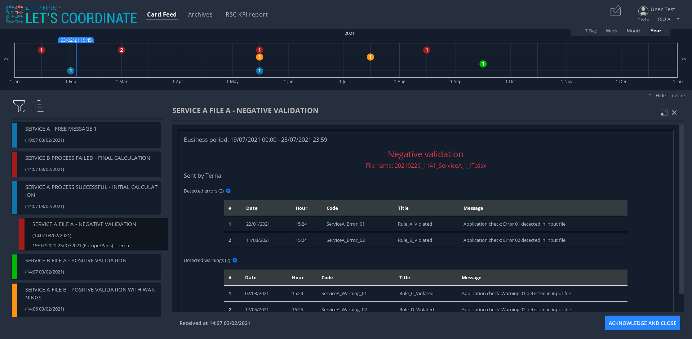

# A Smart Assistant for Transmission System Operators (TSOs) and Regional Security Centers (RSC)

Let’s Coordinate is a modular, extensible, industrial-strength and field-tested platform used to support RSC services between Transmission System Operators (TSOs) and their Regional Security Centers (RSCs). It allows to manage some workflows generated by business RSC tools in a harmonized and single screen and especially enhance the operational communication and coordination.

It offers these features :
* Receiving and handling of operational notifications,
* Archiving of previous notifications,
* Selecting which notifications users want to receive,
* Displaying RSC KPI figures and report.

This application is based on the [OperatorFabric](https://opfab.github.io/) framework.

# What does it do?

To perform their duties, a TSO/RSC operator has to interact with multiple TSO/RSC processes (perform actions, watch for alerts, coordinate decisions etc.) 
at the same time which can prove difficult if there are too many of them.

The idea is to send relevant notifications to operators when their attention is needed and this to help them to focus on the most critical points to make the best decisions.
Additionnaly, aggregate all the notifications from these different processes into a single screen 
and to allow operators to act on them if needed.

These workflows are materialized by *notifications* sorted in a *feed* according to their period of relevance (business period) and their severity (color).
When a notification is selected in the feed, the right-hand pane displays the *details* of the card: information about the process 
(quality of input file, status of the process...), coordination requested, etc.

In addition, the notifications will be displayed as events on a *timeline* at the top of the screen to spatialize them.
This view will be complimentary to the notification feed in that it will allow the operator to see when the event will happen/be relevant.

Part of the value of Let's Coordinate is that it makes the integration of new TSO/RSC services or processes very simple.
It offers a comprehensive and consistent view on all the different but linked processes.

To start publishing notifications to users in an Let's Coordinate instance, all they have to do is:

* Register as a publisher through the "Thirds" service,
* Provide a "bundle" containing handlebars templates defining how cards should be rendered/displayed,
* Publish notifications as JSON containing notification data through the notification publication API.

Let's Coordinate will then:

* Dispatch the notifications to the appropriate TSO/RSC users (by computing the actual users who should receive the card from the recipients rules defined in the card),
* Take care of the rendering of the cards, displaying details, information, action buttons etc.,
* Display relevant information from the cards in the timeline.

Another aim of Let's Coordinate will be to make coordination process easier with a simple framework to capture answers of different operators via dedicated notifications.
This will replace phone calls or emails, making coordination more efficient and traceable.
Dedicated screens to monitor on going coordination and reflect monitoring of answers from operators will be added.

For some ex-post analysis, operators might be interested in knowing why a given decision was made in the past or if the information was received on time : the previous notifications (informative and SMART) will be accessible through the Archives screen.

# Open source

Let’s Coordinate is part of the [LF Energy](https://www.lfenergy.org/) coalition, as an use case of OperatorFabric framework. 
LF energy is a project of The Linux Foundation that supports open source innovation projects within the energy and electricity sectors.

Let's Coordinate is an open source platform licensed under [Mozilla Public License V2](https://www.mozilla.org/en-US/MPL/2.0/). 
The source code is hosted on GitHub in this repository: [letscoordinate](https://github.com/opfab/letscoordinate).

Presentation of the projet [Video](https://www.youtube.com/watch?v=NRMrG9IJx2c).

# Technology stack

## Development
Let's Coordinate is mostly written in Java and based on the Spring framework. 
This makes writing and integrating software for a simplified and better coordination very easy.

 
 

## Continuous Integration / Continuous Delivery
Let's Coordinate is built and integrated using battle-tested tools and (open) platforms. 

