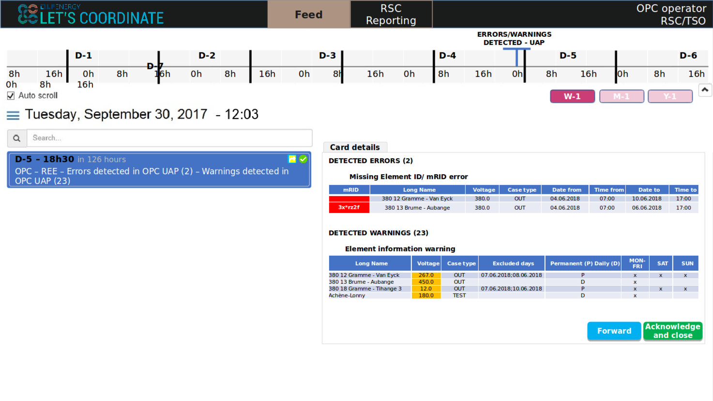
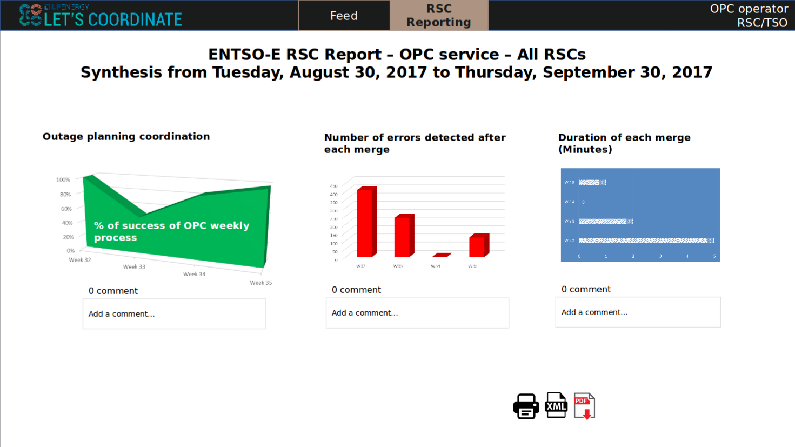

# Executive Summary

This document aims to explain, from a technical point of view, how works the Let's Coordinate tool (Let's Coordinate / Let's Co).  
Let's Coordinate has been developed to ease the communication and the coordination between the TSOs and RSCs of each country.  
The purpose is to help each person who would want to use Let's Co to have clear explanations about the technical aspect

This document covers:

- the technologies used by Let's Co
- the treatment of the datas received from Kafka
- the interactions between the server and the database
- the interactions between the server and the front (e.g. the app. used by the user)
- the interactions between the user and and the front

Each step of these interactions will be explained, from a technical point of view, in the next chapters.

# The technologies used

| Role | Technology | Description |
| ---- | ---------- | ----------- |
| Let's Co server | Spring Boot (REST) | Spring is a Java-based application framework. It is nowadays one of the best tools, if not the best, used to develop complex applications. It can be used in a REST context to receive REST calls from an external front app., as is the case here in the Let's Co app.
| Let's Co front | Angular 6 | Angular is a TypeScript-based open-source full-stack web application framework. Like Spring, it is also nowadays a framework renowned like one of the bests to develop the frontend of an app. It is frequently used with Spring Boot. |
| Let's Co database | MySQL |  |

# The Let's Co use-case

In this part, we will explain each process between two Let's Co components, or between a Let's component and an external tool/component, which all of them make the Let's Co app. work.

## The data reception

Let's Co receives data sent by an external tool under a Json format.  
These datas are received via a Kafka topic. A gateway is continuously listening on this Kafka topic, and as soon as it receives datas, it sends it back to the Let's Co server. This Json is then deserialized and transformed into Java objects, and stored into the Let's Co database.

## The card generation

When receiving these datas, the Let's Co server, besides storing them in the database, sends a new card to the concerned user(s) (TSO/RSC).  
From there, the user can then consult this card on the Let's Co app., with his personal account, and interract with it, according to the type of the received card (see the [function design](https://letscoordinate.github.io/functional-design/) for the different types of cards).

Here is an example of a received card on the app. On the left, the received card. On the right, the details of this card, once the user has clicked on it:

## The reporting

Besides consulting cards, the user can also consult a reporting in relation to all his received cards in the past.  
He selects a start date, an end date, and an RSC (or "all RSCs").  
This request is then sent to the server, which requests the database to obtain the desired informations, and sends them back to the front, which can then display these informations to the user in the form of charts.  
The user can also download this reporting as PDF or xlsx file.

# Security

The security system of the authentication on Let's Co is based on OAuth2.  
For every request made to the server by the app., a token is sent. The server can then check that the user is allowed to obtain the requested datas before responding to the request.  
If he's allowed by the server, the datas are then sent back to the front, otherwise the request is blocked and an error header is sent.

The app. is therefore well secured with a modern tool renowned for its robustness: OAuth2.

# The database

___TO_DO___

# _Revision History_

| Version | Date | Author
| ------- | ---- | ------
| 00.01 | 22/02/19 | CHEHADE Sami
